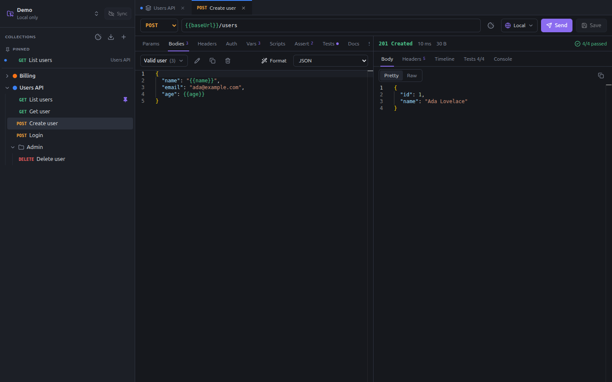

# Milka

Free and open-source API client, in the spirit of Bruno and Postman, with what they charge for or lack:

- **Unlimited workspaces**, each one a git repository, with a **Sync** button (commit, pull, push) and conflict resolution.
- **Several bodies per request**: keep every payload variant of an endpoint (valid, missing field, edge case…) in one request, and pick the one to send.
- **Pre-request / post-response scripts in TypeScript**, with autocompletion and documentation of the whole script API.
- **Assertions and tests** that run in the app and **in CI** with `milka run`, with JUnit and JSON reports.
- **Environments** made of shared variables and **secrets encrypted on your machine**, never committed.
- **Collection colors**, **OpenAPI 3.1 export**, imports from **Bruno, Postman, OpenAPI and cURL**.
- **MCP server** so an AI assistant can create collections and requests, and run them.



## Install

Linux x86_64, with `git` and `openssh-client` (dependencies of the `.deb`).

```bash
curl -fsSL https://raw.githubusercontent.com/romainlavabre/milka/master/install.sh | bash
```

Debian and Ubuntu get the `.deb` package (menu entry and `milka` command); other distributions get the AppImage unpacked
in `~/.local/share/milka`. `./install.sh --help` lists the options (a given version, a downloaded file, `--from-source`,
`--uninstall`).

Milka then updates itself: when a new release is out, a card offers to install it (the `.deb` asks for your password in
a system window) and to restart.

## Quick start

1. **Create a workspace.** Open the workspace menu at the top of the sidebar, **Add workspace…**, **Create new**. To
   share it, set its git remote from the same menu, or clone your team's repository instead.
2. **Create a collection** with the **+** button of the sidebar. Its settings open on the environments.
3. **Create an environment**, say `Local`, with a variable `baseUrl` = `http://localhost:8080`. Click the lock of a row to
   keep its value on your machine only, for a token or a password.
4. **Create a request**: right-click the collection, **New request**. Type `{{baseUrl}}/users` as its URL; the variable
   shows green when it resolves.
5. **Send** with **Ctrl+Enter**, and **save** with **Ctrl+S**. The change is committed; **Sync** shares it with your team.

## Documentation

| Page | What you will find |
|---|---|
| [Workspaces and git sync](docs/workspaces.md) | Create, clone and open workspaces; what is in them; commits, Sync and conflicts |
| [Collections and folders](docs/collections.md) | The sidebar, collection and folder settings, colors, inheritance, auth |
| [Requests](docs/requests.md) | The request bar and tabs, params, several bodies, body types, the response, shortcuts |
| [Variables](docs/variables.md) | `{{variables}}`, where they come from, request variables, built-ins, `{{` completion, hover to edit |
| [Environments and secrets](docs/environments-and-secrets.md) | Environments of a collection, secret values, secrets in CI |
| [Scripts and tests](docs/scripts-and-tests.md) | Script API reference, tests and matchers, assertions, recipes (token refresh, chaining) |
| [Cookies](docs/cookies.md) | The cookie jar and its script API |
| [Runner and CI](docs/runner-and-ci.md) | Running collections, `milka run`, reports, GitHub Actions |
| [Import and export](docs/import-export.md) | Bruno, Postman, OpenAPI, cURL; OpenAPI export |
| [MCP server](docs/mcp.md) | Letting an AI assistant work in your workspaces |

## A request is a YAML file

A workspace is a plain folder of YAML files in a git repository, easy to review in a pull request:

```yaml
# collections/users-api/create-user.yaml
name: Create user
method: POST
url: "{{baseUrl}}/users"
bodies:
  - name: Valid user
    type: json
    content: '{ "name": "{{name}}", "email": "ada@example.com" }'
  - name: Missing name
    type: json
    content: '{ "email": "ada@example.com" }'
activeBody: Valid user
assertions:
  - expr: res.status
    op: eq
    value: "201"
tests: |-
  test('returns the user', () => expect(res.body).toHaveProperty('id'))
```

## Development

```bash
npm install
npm run dev               # the app with hot reload
./run.sh --sandbox        # the same, with a throwaway data folder in .sandbox/
npm run typecheck
npm run lint
npm test                  # unit tests (engine, storage, git sync, CLI, MCP, imports)
npm run test:e2e          # end-to-end tests of the app with Playwright
npm run docs:screenshots  # regenerate the screenshots of docs/images from a demo workspace
npm run dist              # .deb and AppImage in dist/, standalone CLI in out/cli/milka.cjs
./tag.sh                  # publish a release
```

Set `MILKA_DATA_DIR` to use another data folder than `~/.config/milka`. To regenerate the icon after editing
`build/logo.svg`: `npx electron build/render-icon.cjs`.

The screenshots of the documentation come from `e2e/docs-screenshots.spec.ts`, which builds a demo workspace served by
a local server. Run `npm run docs:screenshots` after a change of the interface.

### Architecture

- `src/core`: the engine, pure Node and shared by the app, the CLI and the MCP server: model and YAML storage,
  variables, HTTP, scripts, assertions, runner, reporters, imports and export.
- `src/main`: Electron main process: workspaces and git sync, secrets, IPC handlers.
- `src/preload`: typed bridge exposed to the renderer.
- `src/renderer`: React UI.
- `src/cli`, `src/mcp`: command line and MCP server.

## License

MIT
