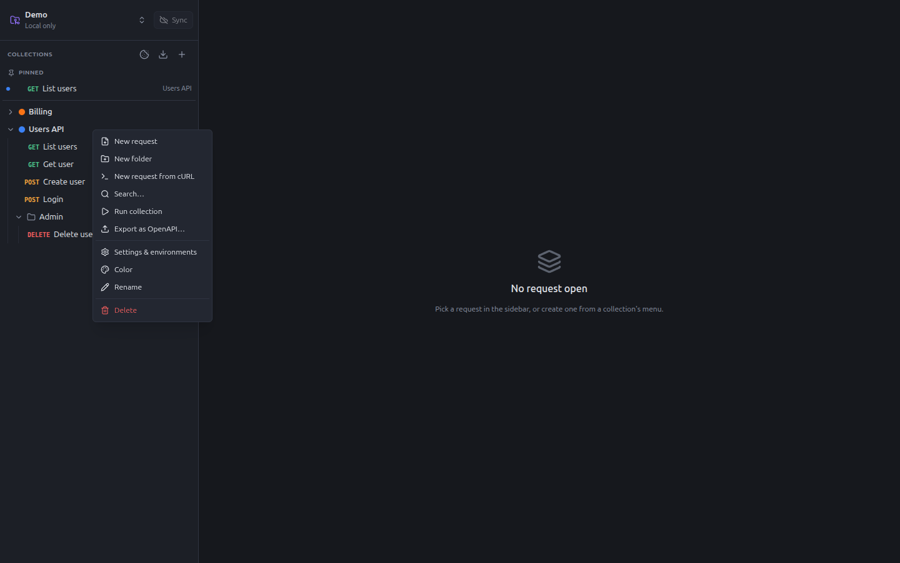
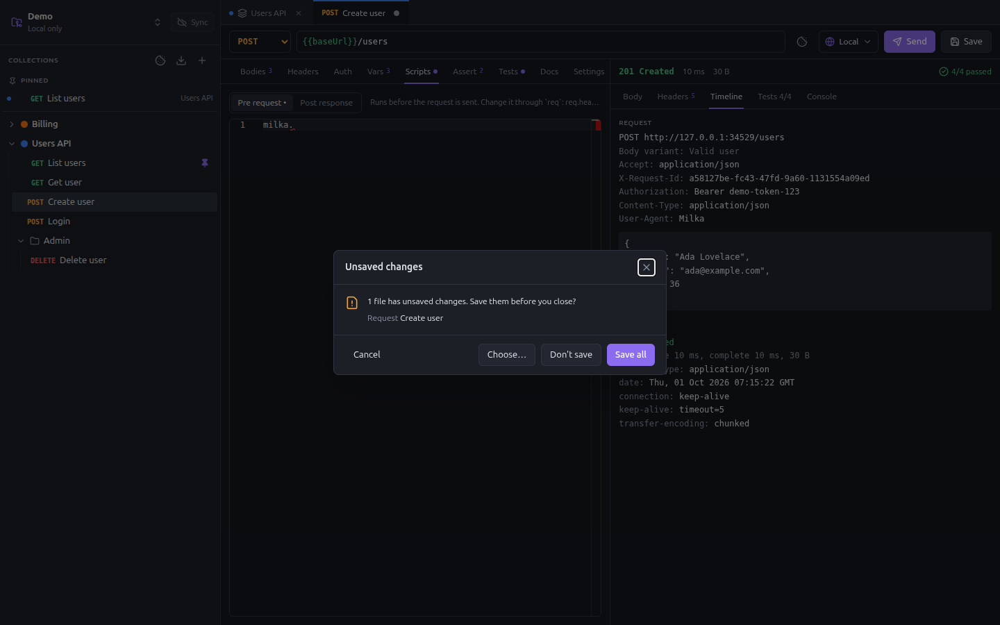
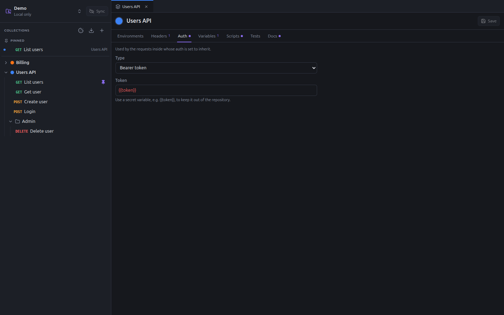

# Collections and folders

A collection groups the requests of one API. Folders organize them inside it. Both hold settings that their requests
inherit: headers, auth, variables, scripts and tests. Write them once on the collection, and every request uses them.

## The sidebar



From top to bottom:

- the workspace menu and the **Sync** button (see [Workspaces](workspaces.md));
- the **Cookies** button, **Import** (Bruno, Postman, OpenAPI, cURL) and **New collection**;
- the **Pinned** requests, which you open often;
- the collections, each with its color dot. They start collapsed; click one to open it.

Hover a collection to show its **Search** and **Settings** buttons. Search filters the folders and requests of the
collection by their name.

Hover a request to show its **Pin** button. Pins are kept on your machine, per workspace; they are not committed.

Drag a request or a folder to move it to another folder, or to reorder it. The order is saved in the files and shared
with your team.

### Context menus

Right-click an item of the sidebar.

| On | Actions |
|---|---|
| a collection | New request, New folder, New request from cURL, Search…, Run collection, Export as OpenAPI…, Settings & environments, Color, Rename, Delete |
| a folder | New request, New folder, Run folder, Settings, Rename, Delete |
| a request | Pin / Unpin, Duplicate, Rename, Delete |

A deleted item can be restored from git (see [Undo a deletion](workspaces.md#undo-a-deletion)).

### Colors

Each collection has a color, chosen from the **Color** submenu or from its settings. The color shows in the sidebar,
in the pinned requests and as the top border of the tabs. Use it to tell your environments apart at a glance, e.g. one
color per service.

## Tabs

Requests, collection settings, folder settings and runs open in tabs. A dot on a tab means it has unsaved changes.
Middle-click a tab, or press **Ctrl+W**, to close it. Changes are kept when you switch tabs; Milka asks before closing a
tab, switching workspace or quitting with unsaved changes:



**Choose…** lets you save some changes and discard others.

## Collection settings

Open them with **Settings & environments** in the menu of the collection, its gear button, or a double-click on its
name.



| Tab | Content |
|---|---|
| Environments | The environments of the collection: see [Environments and secrets](environments-and-secrets.md) |
| Headers | Headers sent by every request of the collection |
| Auth | Default auth of the requests: none, Basic, Bearer token or API key |
| Variables | Variables available to every request, overridden by environments, folders and requests |
| Scripts | Pre-request and post-response scripts run for every request |
| Tests | Tests run after every request |
| Docs | Markdown documentation of the collection |

The name and color sit at the top. **Save** writes `collection.yaml` and commits it.

## Folder settings

Open them with **Settings** in the menu of the folder. They have the same tabs as a collection, without environments.
A folder's auth defaults to **Inherit**.

## Inheritance

When a request is sent, Milka combines the levels from the outside in: collection, then each folder from the outermost
to the innermost, then the request.

| Setting | Rule |
|---|---|
| Headers | All levels are sent. A header of the same name (whatever its case) on an inner level replaces the outer one. |
| Auth | The first level not set to **Inherit**, from the request outwards. None when every level inherits. |
| Variables | The innermost definition wins: request, then folders, then environment, then collection. See [Variables](variables.md). |
| Scripts | All levels run: collection scripts first, then folders, then the request. |
| Tests | All levels run, in the same order. |

For example, with the demo collection above:

- `Accept: application/json` is set on the collection, and `X-Admin: true` on the `Admin` folder. `Delete user`, in that
  folder, sends both.
- The collection uses a Bearer token `{{token}}`. Every request whose auth is **Inherit** (the default) sends
  `Authorization: Bearer <token>`.
- A pre-request script of the collection, `req.setHeader('X-Request-Id', milka.uuid())`, runs before every request.

## Auth types

| Type | Sends |
|---|---|
| Inherit | The auth of the folder or collection (requests and folders only) |
| None | Nothing |
| Basic | `Authorization: Basic base64(username:password)` |
| Bearer token | `Authorization: Bearer <token>` |
| API key | A header, or a query parameter, with the name and value you set |

Basic and Bearer leave an `Authorization` header you set yourself untouched. Use [secret variables](environments-and-secrets.md)
for passwords and tokens, such as `{{token}}`, to keep them out of the repository.

## Docs

Each collection, folder and request has a **Docs** tab, in Markdown. Use it to explain how to get a token, what a
payload variant tests, or which environment to use.

## On disk

```yaml
# collections/users-api/collection.yaml
name: Users API
color: "#3b82f6"
headers:
  - name: Accept
    value: application/json
auth:
  type: bearer
  token: "{{token}}"
vars:
  - name: apiVersion
    value: v1
scripts:
  pre: req.setHeader('X-Request-Id', milka.uuid())
docs: |-
  # Users API

  Create, read and delete the users of the demo service.
```

```yaml
# collections/users-api/admin/folder.yaml
name: Admin
seq: 5
headers:
  - name: X-Admin
    value: "true"
```

Fields left empty are not written, so the files stay short.
