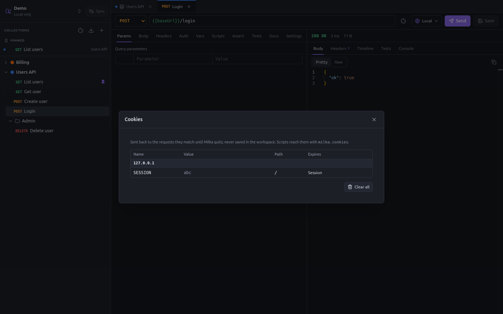

# Cookies

Milka keeps cookies as a browser does. A cookie set by a response, including one set during a redirect, is sent back to
the next requests it matches, by domain, path, expiry and `Secure` flag. Log in once, and the session cookie follows.



## The cookie jar

- There is one jar per workspace, shared by all its collections.
- It lives in memory until Milka quits. It is never written to disk nor committed.
- A run in the runner, `milka run` and each [MCP](mcp.md) session start with an empty jar.

Open the jar with the cookie button of the sidebar, or the one of the request bar. Cookies are grouped by domain, with
their value, path and expiry (**Session** when they expire with the session). Hover a cookie to delete it, or click
**Clear all**.

## In scripts

`url` is any URL of the site; variables are allowed, e.g. `'{{baseUrl}}'`.

| Call | Does |
|---|---|
| `milka.cookies.get(url, name)` | Value of the cookie a request to `url` would send |
| `milka.cookies.getAll(url)` | Name → value of every cookie a request to `url` would send |
| `milka.cookies.set(url, name, value, options?)` | Stores a cookie for `url`, path `/` by default |
| `milka.cookies.delete(url, name)` | Deletes a cookie |
| `milka.cookies.clear(url?)` | Deletes the cookies of `url`, or every cookie |

The options of `set` are `path`, `domain` (to send the cookie to subdomains too), `expires` (a date, or seconds from
now), `secure`, `httpOnly` and `sameSite` (`'strict'`, `'lax'` or `'none'`).

```ts
// Post-response of the login request: keep the access token as a cookie.
milka.cookies.set('{{baseUrl}}', 'ACCESS_TOKEN', res.body.access_token, { expires: 3600 })

// Pre-request of the collection: start every run logged out.
if (req.name === 'Login') milka.cookies.clear('{{baseUrl}}')
```
