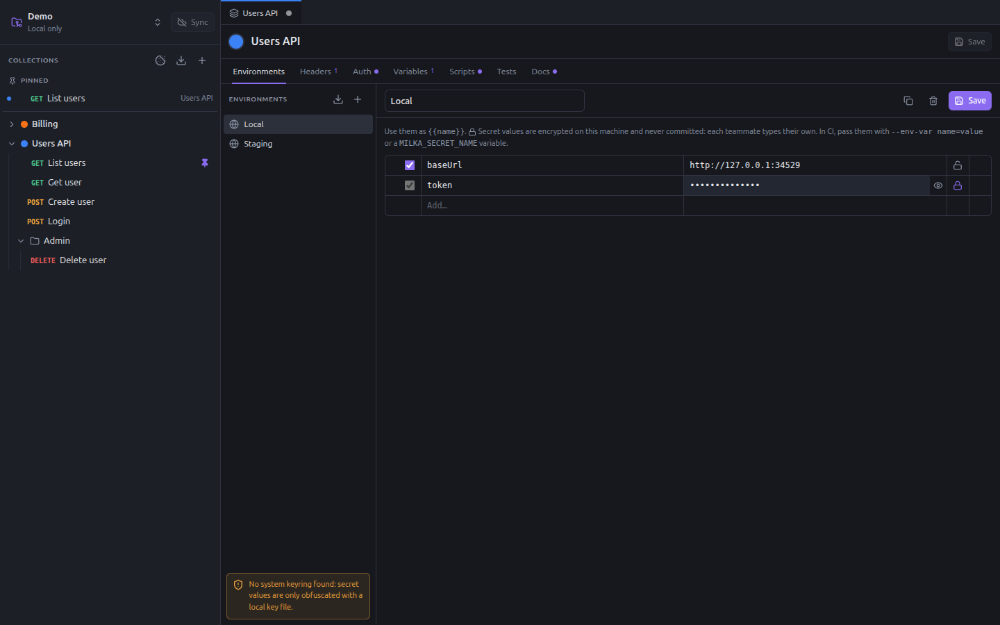

# Environments and secrets

An environment holds the variables of one target: your machine, staging, production. Switch environment and the same
requests hit another server, with other credentials.

Environments belong to a collection: each collection has its own, and its own selected environment.

## Manage environments

Open the collection settings (**Settings & environments** in its menu), on the **Environments** tab.



- The list on the left shows the environments. **+** creates one; the download button imports a Postman environment.
- At the top of the editor: the name, **Duplicate** (with its secret values), **Delete**, and **Save**.
- Each row is a variable: enabled checkbox, name, value, lock, and a delete button on hover. Type in the last row to
  add one, drag the grip to reorder.

The first environment you create becomes the selected one.

## Select an environment

Pick it from the **Environment** menu of the request bar, or of the runner. The choice applies to every request of the
collection and is kept on your machine; it is not committed, so each teammate chooses their own.

Use the variables of the environment as `{{name}}`. They override the variables of the collection, and are overridden
by those of folders and requests (see [Variables](variables.md#where-variables-come-from)).

## Secrets

Click the lock of a row to make it secret. A secret variable:

- keeps its **name** in the environment file, so your team knows it exists;
- keeps its **value** on your machine only, encrypted, never committed;
- shows as a password field, with an eye to reveal it.

Each teammate types their own value. Until they do, the variable shows red in the editors.

```yaml
# collections/users-api/environments/local.yaml: what git sees
name: Local
vars:
  - name: baseUrl
    value: http://localhost:8080
secrets:
  - token
```

Use secrets for passwords, tokens and API keys, and reference them where they are needed: a Bearer auth of
`{{token}}`, a header `X-Api-Key: {{apiKey}}`.

### Where secret values are stored

Values are stored in `~/.config/milka/secrets.json`, encrypted with the system keyring (GNOME Keyring, KWallet…) through
Electron. Without a keyring, Milka falls back to a key file, `~/.config/milka/secrets.key`, readable by you only, and
warns about it in the environments panel: the values are then only obfuscated from someone who can read your files.

When the keyring changes (a new session, a reinstalled system), the saved values cannot be decrypted any more. Milka
says so in the environment and keeps them, in case the keyring comes back; type them again to replace them.

Renaming an environment or a collection moves its secret values. Removing a workspace from Milka forgets them.

### Secrets on the command line and in CI

`milka run` takes the secret values, by order of precedence:

1. `--env-var name=value`;
2. an environment variable `MILKA_SECRET_<NAME>`, where `<NAME>` is the name of the secret in upper case, other
   characters than letters and digits replaced by `_` (`apiKey` → `MILKA_SECRET_APIKEY`, `api-key` →
   `MILKA_SECRET_API_KEY`);
3. on your machine, the values typed in the app.

```bash
MILKA_SECRET_TOKEN=s3cr3t milka run collections/users-api --env staging
```

`milka run` warns about the secrets left without a value. See [Runner and CI](runner-and-ci.md).

The [MCP server](mcp.md) never reads nor writes secret values: an assistant can declare a secret, and you type its
value in the app.

## Import a Postman environment

Click the download button above the list and pick the exported `.json` file. Its secret variables become Milka
secrets: type their values after the import.
