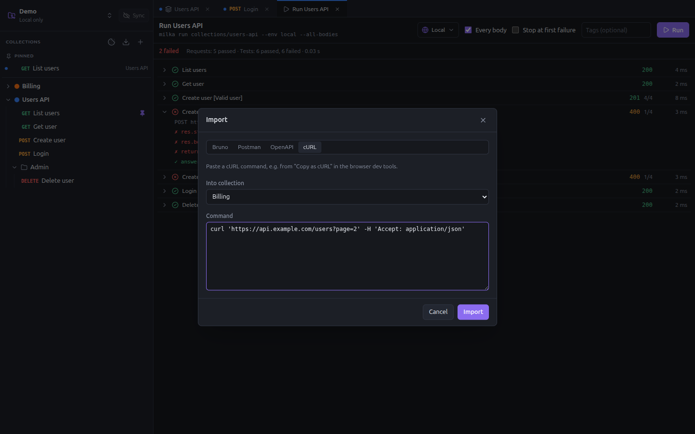

# Import and export

Bring your collections from Bruno, Postman or an OpenAPI document, create requests from cURL commands, and export a
collection as an OpenAPI document.



Click the **Import** button at the top of the sidebar, pick the source, then the file or folder. An imported collection
opens on its settings; warnings, such as a script that could not be converted, show as notifications.

## Bruno

Pick the folder of a Bruno collection: the one holding its `bruno.json` (`.bru` format), or its `opencollection.yml`
(YAML format of Bruno 3).

- Folders, requests, headers, auth, variables, assertions and docs are carried over.
- Environments are imported; secret variables stay secret: type their values after the import.
- Scripts are converted to the Milka API where a call has an equivalent, chai assertions such as
  `expect(x).to.equal(y)` included.
- The bodies of saved examples become extra [bodies](requests.md#several-bodies) of the request.
- WebSocket requests are skipped.

## Postman

Pick a collection exported as **Collection v2.1** JSON. Folders, requests, headers, auth, variables and bodies are
carried over, and the bodies of saved examples become extra bodies of the request.

Postman environments are imported from the environments panel of a collection: see
[Import a Postman environment](environments-and-secrets.md#import-a-postman-environment).

## OpenAPI

Pick an OpenAPI 3 document, YAML or JSON, or paste its content.

- One request per operation, grouped in folders by tag.
- Named examples of the request body become bodies.
- Servers become environments, with a `baseUrl` variable.

## cURL

Pick the target collection and paste a command, e.g. from **Copy as cURL** in the network tab of the browser dev tools.
The method, URL, headers, body and basic auth become a new request, which opens at once.

**New request from cURL**, in the menu of a collection, does the same straight into that collection.

## Export as OpenAPI

Right-click a collection, **Export as OpenAPI…**, and choose where to write the file: `.yaml` or `.json`. The document
is OpenAPI 3.1; the bodies of each request become its named examples.

## From the command line

Run them from a workspace folder, or pass `--workspace <folder>`:

```bash
milka import bruno ~/bruno/users-api
milka import postman ~/Downloads/users-api.postman_collection.json
milka import openapi openapi.yaml
milka import curl "curl https://api.example.com/users -H 'Accept: application/json'" --into collections/users-api
milka export openapi collections/users-api -o openapi.yaml
```

Without `-o`, `milka export` writes the YAML document to the standard output.
