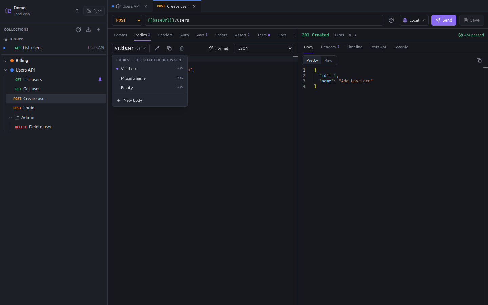
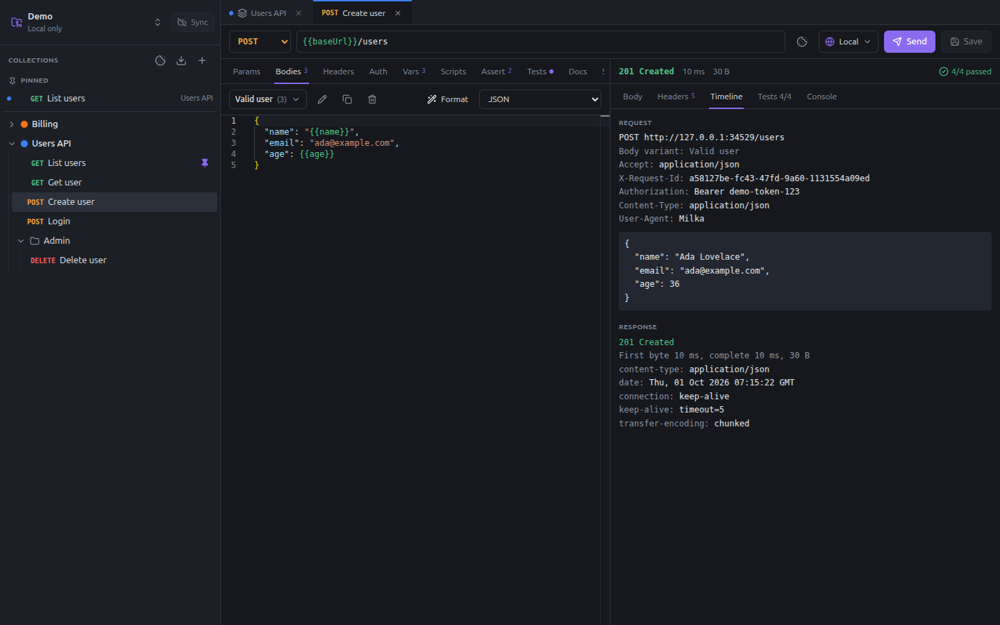

# Requests

Create a request from the menu of a collection or folder (**New request**), or from a cURL command (**New request from
cURL**). Click it in the sidebar to open it.


## The request bar

- **Method**: GET, POST, PUT, PATCH, DELETE, HEAD or OPTIONS.
- **URL**: may contain [variables](variables.md) (`{{baseUrl}}/users`), a query string (`?page=2`) and path parameters
  (`/users/:id`).
- **Cookies**: the cookie jar of the workspace (see [Cookies](cookies.md)).
- **Environment**: the environment used to send the requests of this collection (see
  [Environments and secrets](environments-and-secrets.md)).
- **Send** (**Ctrl+Enter**), **Cancel** while it runs, and **Save** (**Ctrl+S**).

Changes are not written until you save. Sending does not need a save: Milka sends what you see.

## Request tabs

| Tab | Content |
|---|---|
| Params | Query parameters, and the path parameters of the URL |
| Body / Bodies | The payloads of the request: see [Several bodies](#several-bodies) |
| Headers | Headers of this request, added to those of the collection and folders |
| Auth | Inherit (default), None, Basic, Bearer token or API key: see [Auth types](collections.md#auth-types) |
| Vars | Variables set before the request, and variables taken from the response: see [Variables](variables.md#request-variables) |
| Scripts | Pre-request and post-response scripts: see [Scripts and tests](scripts-and-tests.md) |
| Assert | Checks on the response, without code: see [Assertions](scripts-and-tests.md#assertions) |
| Tests | Test script run after the response: see [Scripts and tests](scripts-and-tests.md#tests) |
| Docs | Markdown documentation of the request |
| Settings | Timeout, redirects and tags |

The count next to a tab name tells how many rows it holds; a dot tells it has content.

### Params

The URL bar and the **Params** table stay in sync: type `?page=2` in the URL and a `page` row appears; uncheck the row
and it leaves the URL.

A `:name` segment of the URL is a path parameter. It gets its own row, whose value replaces the segment when sending:
`{{baseUrl}}/users/:id` with `id` = `{{userId}}` sends `/users/42`.

### Headers and key/value tables

Each row of the Params, Headers, Vars and form tables has a checkbox: an unchecked row is kept but not sent. Type in the
last row (**Add…**) to add one. Drag the grip at the start of a row to reorder it.

### Settings

| Setting | Default |
|---|---|
| Timeout | 30 seconds |
| Follow redirects | On |
| Maximum redirects | 5 |
| Tags | None. The runner and `milka run --tags` use them to pick requests. |

## Several bodies

A request can keep several bodies: the valid payload, one with a missing field, an edge case… They are variants of the
same endpoint, with the same URL, headers and tests. The selected one is sent.



In the **Bodies** tab:

- the selector lists the bodies, with their type; pick the one to send;
- **New body** adds one; the pencil renames the selected body, the copy button duplicates it, the bin deletes it;
- the type selector sets the type of the selected body;
- **Format** indents a JSON body.

Every body variant can be run in one go with the runner's **Every body** option, or `milka run --all-bodies`: each
variant is reported as its own case, e.g. `Create user [Missing name]`. Scripts know which one is sent through
`req.bodyName`.

### Body types

| Type | Content | Content-Type sent |
|---|---|---|
| none | No body | none |
| json | JSON text | `application/json` |
| xml | XML text | `application/xml` |
| text | Any text | `text/plain` |
| form | Name/value fields | `application/x-www-form-urlencoded` |
| multipart | Text fields and files | `multipart/form-data` |
| graphql | A query, and its variables as JSON | `application/json` |
| binary | A file, sent as is | `application/octet-stream` |

A `Content-Type` header you set yourself wins over the default one.

Variables work in every body. In a JSON body, a variable may stand for a whole value without quotes:

```json
{
  "name": "{{name}}",
  "age": {{age}},
  "tags": {{tags}}
}
```

The editor accepts it, **Format** keeps it, and the variable is replaced before sending.

## The response

The status line shows the status (colored by family), the time, the size, and the number of tests passed. **Retried**
shows when a script sent the request again with `milka.retry()`, **Skipped** when it called `milka.skip()`.

| Tab | Content |
|---|---|
| Body | **Pretty** (highlighted JSON, HTML or XML; images shown as images) or **Raw**, and a copy button |
| Headers | Response headers |
| Timeline | What was really sent, after variables and scripts: method, URL, body variant, headers and body; then the redirects, the time to the first byte and the total time |
| Tests | Each assertion and test, passed or failed, with the reason of the failure |
| Console | What the scripts logged with `console.log` |



The Timeline is the place to check what a request really sent: the resolved URL, the inherited headers, the token,
the body after variables.

The last response of each tab is kept while Milka is open.

## Keyboard shortcuts

| Shortcut | Action |
|---|---|
| Ctrl+Enter | Send the request |
| Ctrl+S | Save |
| Ctrl+W | Close the tab |
| Ctrl+Space | Autocomplete in a script editor |

## On disk

```yaml
# collections/users-api/create-user.yaml
name: Create user
seq: 3
method: POST
url: "{{baseUrl}}/users"
bodies:
  - name: Valid user
    type: json
    content: |-
      {
        "name": "{{name}}",
        "email": "ada@example.com",
        "age": {{age}}
      }
  - name: Missing name
    type: json
    content: |-
      {
        "email": "ada@example.com"
      }
activeBody: Valid user
vars:
  pre:
    - name: name
      value: Ada Lovelace
    - name: age
      value: "36"
  post:
    - name: userId
      value: res.body.id
assertions:
  - expr: res.status
    op: eq
    value: "201"
  - expr: res.body.id
    op: exists
tests: |-
  test('returns the new user', () => {
    expect(res.body).toHaveProperty('id')
    expect(res.body.name).toBe('Ada Lovelace')
  })
```

Other fields, written only when set: `tags`, `params` (with `type: path` for path parameters), `headers`, `auth`,
`scripts` (`pre` and `post`), `docs`, `settings` (`timeout` in milliseconds, `followRedirects`, `maxRedirects`). A
`form` or `multipart` body has `fields` instead of `content`; a file field has `type: file` and the path of the file as
its value. A `binary` body has the path of the file as its content.
