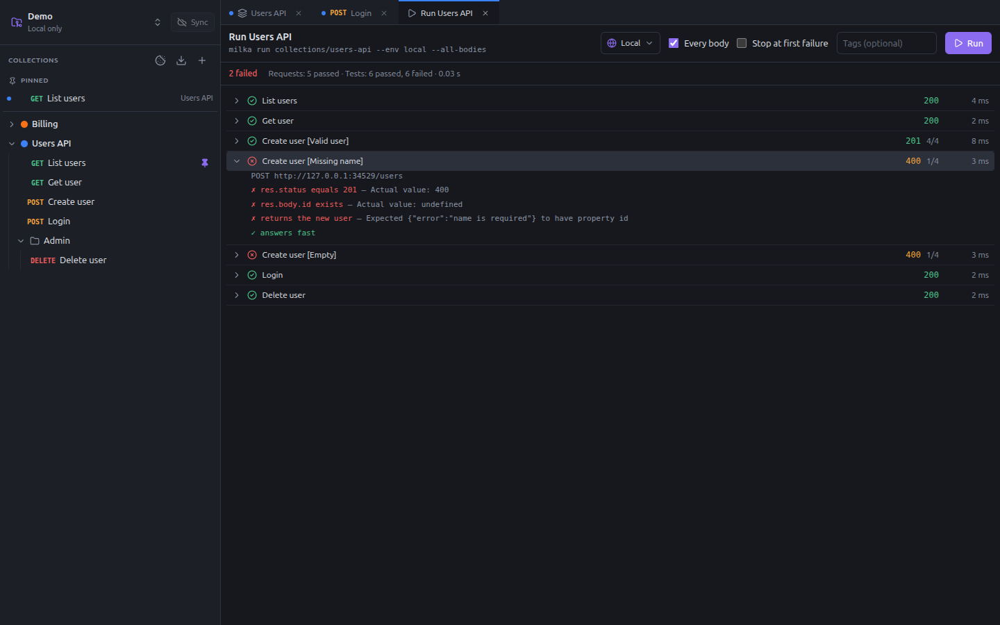

# Runner and CI

The runner sends every request of a collection or folder, in order, and reports their assertions and tests. The same run
works in the terminal and in CI with `milka run`.

## The runner

Right-click a collection, **Run collection**, or a folder, **Run folder**.



- **Environment**: the environment of the run.
- **Every body**: runs each body variant of the requests that have several, as separate cases (`Create user [Missing
  name]`).
- **Stop at first failure**: stops at the first request or test that fails.
- **Tags**: only the requests with one of these tags (comma-separated). Tags are set in the **Settings** tab of a
  request.
- **Run**, then **Stop** while it runs.

Requests run in the order of the sidebar and share the variables their scripts set: a token fetched by the first
request is used by the next ones. Each run starts with an empty cookie jar.

The summary line counts the requests and tests passed and failed. Click a case to see its URL and every assertion and
test, with the reason of each failure. The line under the title is the `milka run` command that does the same run.

## `milka run`

```bash
milka run collections/users-api --env staging
```

The path is a workspace, a collection folder, a folder inside it, or a request file:

```bash
milka run .                                              # every collection of the workspace
milka run collections/users-api                          # one collection
milka run collections/users-api/admin                    # one folder
milka run collections/users-api/create-user.yaml         # one request
```

| Option | Effect |
|---|---|
| `--env <name>` | Environment to use, by name or file name |
| `--env-var <name=value>` | Sets a variable, overriding the environment. Repeatable. |
| `--reporter junit=<file>` | Writes a JUnit XML report. Repeatable. |
| `--reporter json=<file>` | Writes a JSON report. Repeatable. |
| `--all-bodies` | Runs every body of the requests that have several |
| `--tags <a,b>` | Only the requests with one of these tags |
| `--exclude-tags <a,b>` | Skips the requests with one of these tags |
| `--bail` | Stops at the first failure |
| `--insecure` | Accepts invalid TLS certificates |
| `--delay <ms>` | Pauses between requests |

Exit codes: `0` when every request passed, `1` when a request or a test failed, `2` on a usage error.

Secret values come from `--env-var`, from `MILKA_SECRET_<NAME>` environment variables, and on your machine from the
values typed in the app. See [Secrets on the command line and in CI](environments-and-secrets.md#secrets-on-the-command-line-and-in-ci).

```bash
MILKA_SECRET_TOKEN=s3cr3t milka run collections/users-api \
  --env staging --all-bodies --reporter junit=reports/api.xml
```

## In CI

CI machines only need Node.js 20 or later: every release ships `milka-cli-X.Y.Z.cjs`, the whole command line in one
file. Run it with `node milka.cjs run …`.

### GitHub Actions

```yaml
# .github/workflows/api.yml
name: API tests
on: [push]
jobs:
  api-tests:
    runs-on: ubuntu-latest
    steps:
      - uses: actions/checkout@v4
      - uses: actions/setup-node@v4
        with: { node-version: 22 }
      - run: gh release download --repo romainlavabre/milka --pattern 'milka-cli-*.cjs' --output milka.cjs
        env: { GH_TOKEN: '${{ github.token }}' }
      - run: node milka.cjs run collections/users-api --env ci --reporter junit=reports/api.xml
        env: { MILKA_SECRET_TOKEN: '${{ secrets.API_TOKEN }}' }
```

Add a step publishing `reports/api.xml` with your favorite JUnit reporter action to see the results in the pull request.

## Other commands

| Command | Does |
|---|---|
| `milka` | Opens the app |
| `milka import bruno\|postman\|openapi <source>` | Imports a collection: see [Import and export](import-export.md) |
| `milka import curl "<command>" --into collections/<collection>` | Creates a request from a cURL command |
| `milka export openapi collections/<collection> [-o file]` | Exports a collection as OpenAPI 3.1 |
| `milka mcp [--workspace <folder>]` | Starts the [MCP server](mcp.md) |
| `milka help` | Shows the help |
| `milka version` | Shows the version |
