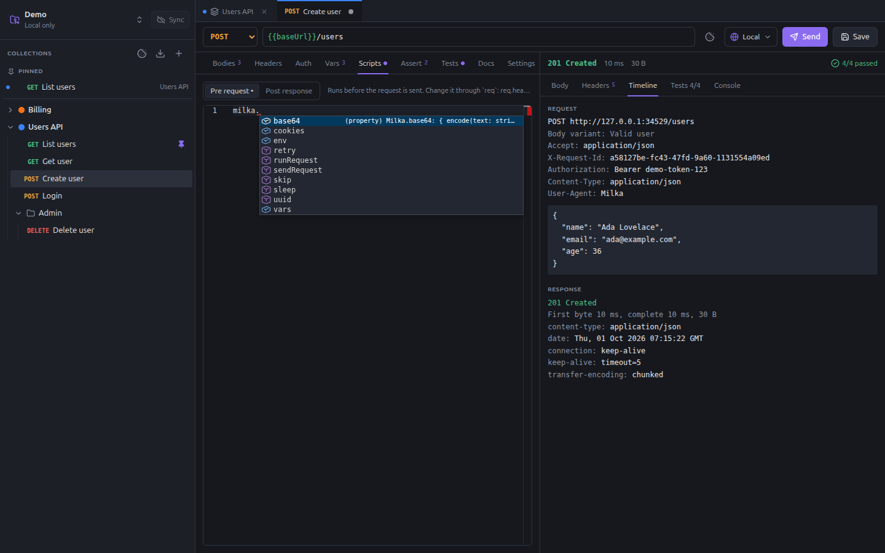
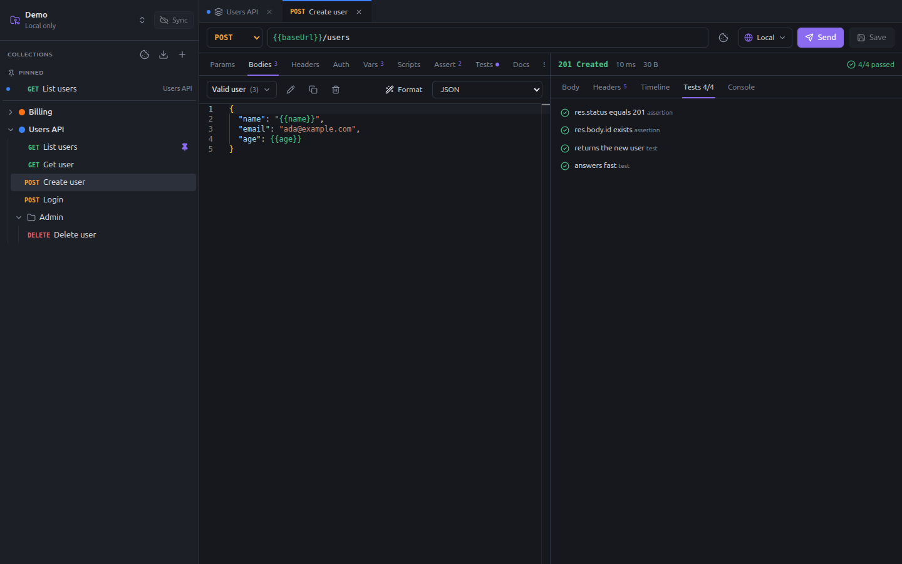
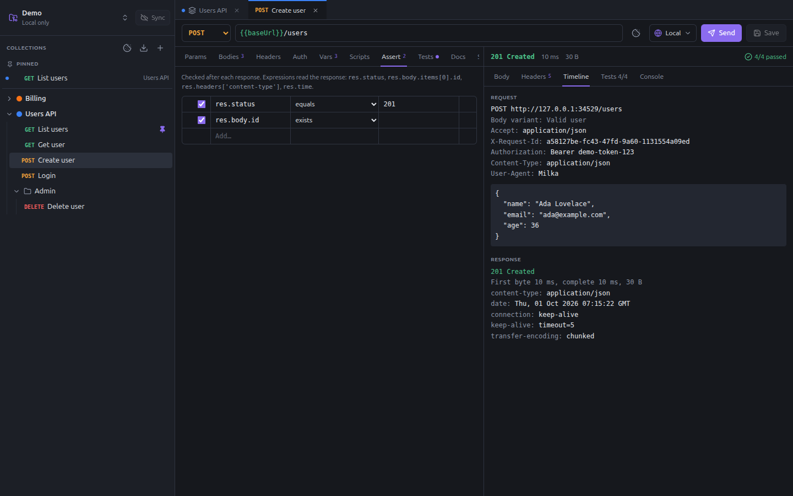

# Scripts and tests

Scripts change a request before it is sent, read its response, chain requests and check the results. They are
TypeScript (or plain JavaScript), and the editor completes and documents the whole API as you type.



## Where scripts live

Collections, folders and requests each have:

- a **Scripts** tab, with a **Pre request** script, run before sending, and a **Post response** script, run after the
  response;
- a **Tests** tab, run after the post-response scripts;
- requests also have an **Assert** tab, for checks without code.

Scripts of every level run, from the outside in: collection, folders (outermost first), request. A script written once on
the collection applies to all its requests.

## What happens when you send

1. Milka gathers the [variables](variables.md), then sets the request variables of the **Vars** tab.
2. The **pre-request** scripts run. They can change `req`, set variables, send other requests, or skip this one.
3. Variables are replaced, the auth is applied, the body is encoded, and the request is sent.
4. The **post-response variables** of the **Vars** tab are evaluated, then the **post-response** scripts run.
5. The **assertions** run, then the **tests** scripts.
6. If a post-response script called `milka.retry()`, everything runs once more, from step 1.

A script that throws stops the execution and shows its error, with the line number. `console.log()` writes to the
**Console** tab of the response.

## API reference

### `req`: the request

Available in every script.

| Member | Description |
|---|---|
| `req.name` | Name of the request (read-only) |
| `req.method` | HTTP method; can be changed in pre-request scripts |
| `req.url` | URL with its query string, before variables are replaced |
| `req.headers` | Headers inherited from the collection and folders plus the request's own, as an object. Add, change or delete keys. |
| `req.body` | Parsed JSON for JSON bodies, `{ query, variables }` for GraphQL, a field map for forms, text otherwise, `undefined` without a body. Assign it to replace the body. |
| `req.bodyName` | Name of the body variant being sent, or `null` (read-only) |
| `req.setHeader(name, value)` | Sets a header, replacing any header of the same name whatever its case |
| `req.removeHeader(name)` | Removes a header, whatever its case |

### `res`: the response

Available in post-response scripts and tests.

| Member | Description |
|---|---|
| `res.status` | Status code, e.g. `201` |
| `res.statusText` | e.g. `Created` |
| `res.headers` | Headers, with lower-cased names; repeated headers are joined with `, ` |
| `res.header(name)` | A header, whatever the case of its name |
| `res.body` | Parsed JSON when the body is JSON, text otherwise |
| `res.text` | Raw body text |
| `res.time` | Total time, in milliseconds |
| `res.size` | Body size, in bytes |

### `milka`: variables and helpers

| Member | Description |
|---|---|
| `milka.vars.get(name)` | Value of a variable, from any scope, by precedence |
| `milka.vars.set(name, value)` | Keeps a runtime value for the next requests (objects are stored as JSON) |
| `milka.vars.has(name)` / `milka.vars.delete(name)` | Tests for / forgets a runtime value |
| `milka.env.name` | Name of the selected environment, or `null` |
| `milka.env.get(name)` | A variable of the selected environment |
| `milka.cookies` | The cookie jar: see [Cookies](cookies.md#in-scripts) |
| `await milka.sendRequest({ method, url, headers, body })` | Sends another HTTP request and returns its response. `url` may contain variables; an object body is sent as JSON. 30 s timeout. |
| `await milka.runRequest(path, { body })` | Runs another request of the collection: see below |
| `milka.retry()` | Post-response only: sends this request again: see below |
| `milka.skip(reason?)` | Pre-request only: does not send this request; the run goes on and shows it as **Skipped** |
| `milka.uuid()` | A random UUID v4 |
| `await milka.sleep(ms)` | Waits |
| `milka.base64.encode(text)` / `decode(b64)` | Base64, UTF-8 safe |

#### `milka.runRequest(path, options?)`

Runs a request of the same collection, given by its path in the collection, such as `'auth/token.yaml'`, with
everything it inherits: headers, auth, scripts, assertions and tests. `options.body` picks a body variant other than
the selected one.

It shares the variables, environment and cookie jar of the current request: what its scripts set is seen at once. Its
logs show in the console of the current request; its tests stay its own. It throws when the request cannot be sent, a
script fails, or it is skipped. Requests nest 3 levels deep at most.

#### `milka.retry()`

Called in a post-response script, it sends the request once more after every post-response script has run, from its
pre-request scripts on. It works once per execution, and is ignored inside `runRequest`. The response shown and tested is
the second one, marked **Retried**.

### Tests

```ts
test('returns the new user', () => {
  expect(res.status).toBe(201)
  expect(res.body).toHaveProperty('id')
  expect(res.body.name).toBe('Ada Lovelace')
})
```

`test(name, fn)` declares a test; `fn` may be `async`. Tests can be written in the **Tests** tab or in post-response
scripts, not in pre-request scripts. Each test passes when `fn` does not throw.

`expect(value)` takes these matchers, each one negated with `.not` (`expect(x).not.toBe(1)`):

| Matcher | Passes when |
|---|---|
| `toBe(x)` | strictly equal (`Object.is`) |
| `toEqual(x)` | deeply equal, for objects and arrays |
| `toBeDefined()` / `toBeUndefined()` | not `undefined` / `undefined` |
| `toBeNull()` | `null` |
| `toBeTruthy()` / `toBeFalsy()` | truthy / falsy |
| `toBeGreaterThan(n)`, `toBeGreaterThanOrEqual(n)`, `toBeLessThan(n)`, `toBeLessThanOrEqual(n)` | compares numbers |
| `toContain(x)` | a string contains the substring, or an array contains the item (deep equality) |
| `toMatch(re)` | a string matches the regex or string |
| `toHaveLength(n)` | `length` is `n` |
| `toHaveProperty(path, value?)` | has the property at a dotted path (`'user.id'`), optionally with that value |
| `toBeTypeOf(type)` | `'string'`, `'number'`, `'boolean'`, `'object'`, `'array'`, `'null'` or `'undefined'` |
| `toBeOneOf([a, b])` | equals one of the values |

Results show in the **Tests** tab of the response, assertions first:



### Other globals

`console.log/info/warn/error/debug`, `setTimeout`, `clearTimeout`, `URL`, `URLSearchParams`, `TextEncoder`,
`TextDecoder`, `atob`, `btoa`, `structuredClone` and `crypto.randomUUID()`. There is no `fetch` (use
`milka.sendRequest`) and no `require`.

A script stops after 5 seconds of computing, and after 60 seconds of waiting (requests, `sleep`).

## Assertions

The **Assert** tab covers the common checks without code. Each row is an expression on the response, an operator and an
expected value:



| Operator | Checks |
|---|---|
| equals / not equals | deep equality |
| `>` `>=` `<` `<=` | number comparison |
| contains / not contains | substring of a string, or item of an array |
| matches regex | a string matches the regular expression |
| exists / does not exist | the value is neither `undefined` nor `null` / is one of them |
| is type | `string`, `number`, `boolean`, `object`, `array` or `null` |
| has length | the `length` of a string or array |

The expected value is read according to the actual one: `201` is a number when the status is a number, `true` a boolean,
`{…}` or `[…]` JSON. Examples:

- `res.status` equals `201`
- `res.body.id` exists
- `res.headers['content-type']` contains `json`
- `res.body.items` has length `10`
- `res.time` `<` `500`

Assertions run before the tests and are reported with them.

## Recipes

### Add a header to every request

On the collection, pre-request:

```ts
req.setHeader('X-Request-Id', milka.uuid())
```

### Fetch a token once

On the collection, pre-request:

```ts
if (!milka.vars.get('token')) {
  const login = await milka.sendRequest({
    method: 'POST',
    url: '{{baseUrl}}/login',
    body: { user: 'ci', password: milka.env.get('password') }
  })
  milka.vars.set('token', login.body.token)
}
```

With the collection auth set to Bearer `{{token}}`, every request then sends it.

### Refresh an expired token and retry

Keep the login in its own request, `auth/token.yaml`, whose post-response script stores the token:

```ts
milka.vars.set('token', res.body.access_token)
```

On the collection, post-response:

```ts
if (res.status === 401 && req.name !== 'Token') {
  await milka.runRequest('auth/token.yaml')
  milka.retry()
}
```

A request answered with 401 fetches a new token and is sent again; the response you see is the second one. When the
token travels in a cookie, store it with `milka.cookies.set(milka.env.get('host'), 'ACCESS_TOKEN',
res.body.access_token)` instead.

### Chain requests

On `Create user`, post-response (or a `userId` = `res.body.id` row in the **Vars** tab):

```ts
milka.vars.set('userId', res.body.id)
```

`Get user` and `Delete user` then use `{{userId}}`. In the runner, requests run in order and see what the previous ones
set.

### Skip a request

```ts
if (milka.env.name === 'Production') milka.skip('never on production')
```

### Change the payload of a body variant

```ts
if (req.bodyName === 'Valid user') req.body.email = `ada+${milka.uuid()}@example.com`
```

## Security

Scripts run on your machine with your rights, like the scripts of a `package.json`. Only open workspaces you trust.
