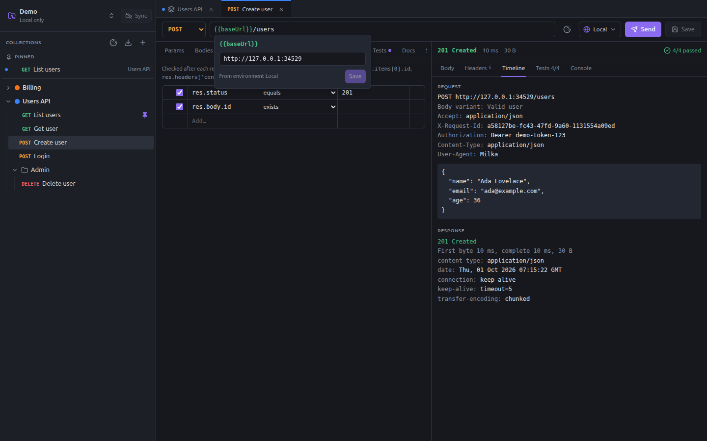
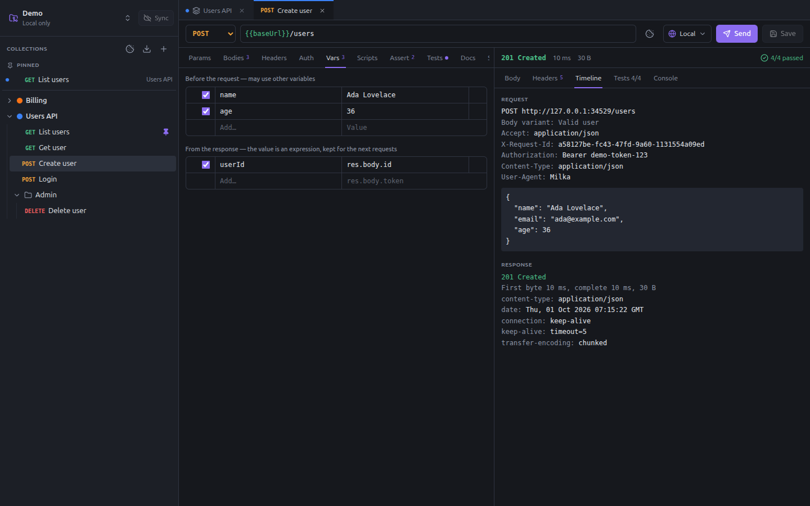

# Variables

Write `{{name}}` wherever a value changes from one environment or one request to another: base URL, ids, tokens.
Variables work in the URL, params, headers, bodies and auth fields. Spaces are allowed: `{{ name }}`.

## Type `{{` to pick one

Typing `{{` lists every variable the request can use, with where it comes from and its value (a secret stays masked).
Keep typing to filter, then **Enter** or **Tab** (or a click) writes `{{name}}`; **Escape** closes the list. The list
follows the same order as the resolution below, built-ins last. In a body, the names come as editor suggestions.

## Green and red

A variable shows **green** when it resolves and **red** when it does not: a typo, a variable of another environment, a
secret whose value you have not typed yet. In the [collection settings screenshot](images/collection-settings.png),
`{{token}}` is red because no environment is selected yet.

## Hover to see and edit

Hover a variable for a moment to see its value and where it comes from: the request, a folder, the environment, the
collection, a script (runtime) or a built-in.



Change the value there and **Save**: it is written where the variable is defined. A secret stays on your machine. An
undefined variable is created in the selected environment, or in the request, folder or collection being edited when
no environment is selected.

## Where variables come from

From the highest precedence to the lowest:

1. **Runtime variables**: set by scripts (`milka.vars.set`) or by the post-response variables of a request. They live
   in memory until Milka quits, and are shared by every request of the workspace.
2. **Request variables**, set before the request (the **Vars** tab).
3. **Folder variables**, the innermost folder first.
4. **The selected environment**: its shared variables and your local secret values.
5. **Collection variables**.
6. **Built-in variables**.

A disabled row is ignored. There are no global variables: everything belongs to a collection.

A value may itself use variables, up to 5 levels deep: `baseUrl` = `https://{{host}}/{{apiVersion}}`. An unknown
variable is left as written, so `{{typo}}` shows up as is in the [Timeline](requests.md#the-response).

## Request variables

The **Vars** tab of a request has two tables.



- **Before the request**: name and value, set before sending. The value may use other variables.
- **From the response**: name and an expression evaluated on the response, such as `res.body.id`,
  `res.headers['location']` or `res.body.items[0].id`. The result is kept as a runtime variable for the next requests.

With `userId` = `res.body.id` on `Create user`, a following `Get user` on `{{baseUrl}}/users/{{userId}}` reads the user
just created. In the editor, `{{userId}}` shows green even before the first send, since a request of the collection
sets it.

## Built-in variables

| Variable | Value |
|---|---|
| `{{$uuid}}` | A random UUID v4 |
| `{{$timestamp}}` | Current Unix time, in seconds |
| `{{$isoTimestamp}}` | Current time, ISO 8601 |
| `{{$randomInt}}` | A random integer from 0 to 999 |
| `{{process.env.NAME}}` | The environment variable `NAME` of the process (Milka or `milka run`) |

## In scripts

```ts
const id = milka.vars.get('userId')     // any scope, by precedence
milka.vars.set('token', res.body.token)  // runtime variable, for the next requests
milka.vars.has('token')
milka.vars.delete('token')
milka.env.name                           // name of the selected environment, or null
milka.env.get('baseUrl')                 // a variable of the environment only
```

The script editor completes the names of the variables of the collection. See [Scripts and tests](scripts-and-tests.md).
