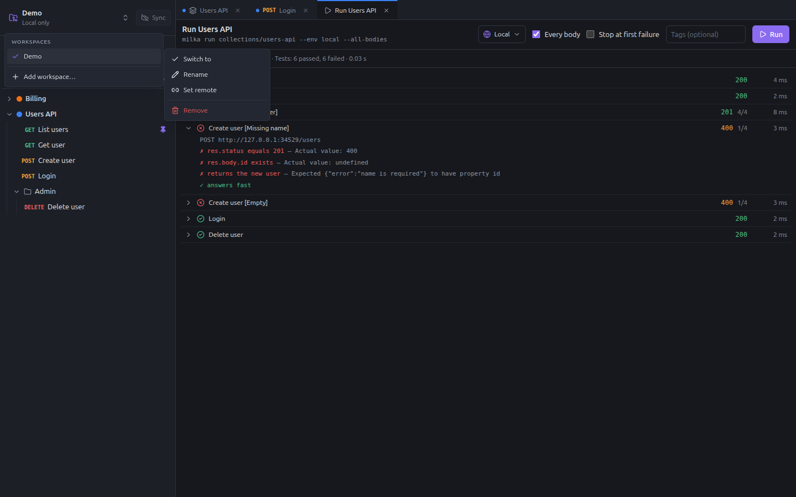
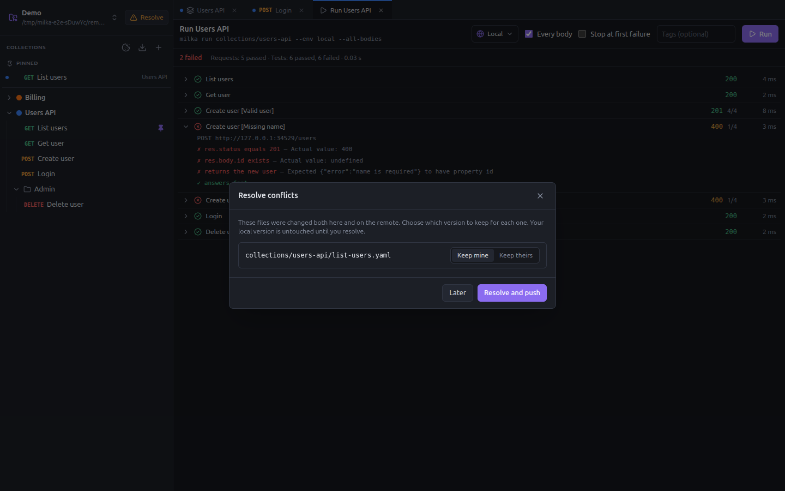

# Workspaces and git sync

A workspace is a git repository holding collections. Milka has no limit on their number: one per client, one per
team, one for your experiments.



## Add a workspace

Open the workspace menu at the top of the sidebar, then **Add workspace…**:

- **Create new**: a new git repository, initialized with a first commit (`Initialize workspace`).
- **Clone a repository**: the repository of your team, from an SSH or HTTPS URL.
- **Open a folder**: a folder already on your disk, such as a Milka workspace you cloned yourself.

Created and cloned workspaces live in `~/.config/milka/workspaces/<name>` (set `MILKA_DATA_DIR` to use another folder
than `~/.config/milka`).

Each workspace of the menu has a submenu:

- **Switch to**: switching first pulls the changes of your colleagues. Unsaved changes are asked about before you
  leave.
- **Rename**: changes the name shown in Milka only.
- **Set remote** / **Change remote**: the URL of the shared repository, e.g. `git@github.com:team/api-workspace.git`.
- **Remove**: removes the workspace from Milka and forgets the secrets typed for its environments. The local clone is
  deleted when Milka created it; a folder you opened yourself is kept. The remote repository is not touched.

## What is in a workspace

```
milka.json                          name of the workspace and format version
collections/
  users-api/
    collection.yaml                 name, color, headers, auth, variables, scripts, tests, docs
    environments/
      local.yaml                    shared variables, and the names of the secret ones
      staging.yaml
    list-users.yaml                 one file per request
    create-user.yaml
    admin/
      folder.yaml                   what the requests of the folder inherit
      delete-user.yaml
```

Everything is plain YAML, so changes are easy to review in a pull request. File names come from the names you give in
the app (`Create user` → `create-user.yaml`); the order in the sidebar is kept in the `seq` field of each file. Folders
can be nested.

Milka watches the folder: a file changed by hand, by `git pull` or by the [MCP server](mcp.md) shows up in the app at
once.

## Commits and Sync

Every change made in the app is committed on its own, with a readable message such as `Add request "Create user"`, and
pushed in the background a moment later. You never have to write a commit message.

The **Sync** button, next to the workspace name, does the rest:

1. commits the changes made outside the app (`Update workspace`);
2. fetches the remote;
3. rebases your commits on `origin/master` when your colleagues pushed;
4. pushes your commits.

The button shows `↑2` when you have commits to push and `↓3` when there are commits to pull; its tooltip says when the
last sync happened. Without a remote, the button is disabled and the workspace shows **Local only**: set a remote from
the workspace menu to share it.

When Milka quits, it waits a few seconds for a pending push to finish.

### Conflicts

When you and a colleague changed the same file, the rebase is cancelled and your files are left untouched. The Sync
button becomes **Resolve**:



For each file, choose **Keep mine** or **Keep theirs**, then **Resolve and push**. Milka merges the remote branch,
keeps the version you chose for each file, commits `Merge remote workspace changes` and pushes. **Later** leaves the
workspace as it is; you can resolve whenever you like.

There is no line-by-line merge: to combine both versions, keep yours, then copy the part you need from the git history.

### Authentication

- SSH remotes use your SSH agent: run `ssh-add` once if your key has a passphrase.
- HTTPS remotes use your git credential helper (`git config --global credential.helper`).

Milka never asks for a password. When git refuses, the Sync tooltip shows the reason.

### Branch and identity

A workspace always uses the `master` branch; a repository on `main` is renamed. Commits are signed with your git
identity (`git config user.name` and `user.email`), or `Milka <milka@localhost>` when you have none.

## Undo a deletion

Since every change is a commit, a deleted request, folder or collection can be brought back from git:

```bash
cd ~/.config/milka/workspaces/<workspace>
git log --oneline -- collections/users-api/create-user.yaml
git checkout <commit>^ -- collections/users-api/create-user.yaml
```

The app picks the restored file up at once, and the next Sync commits it.
